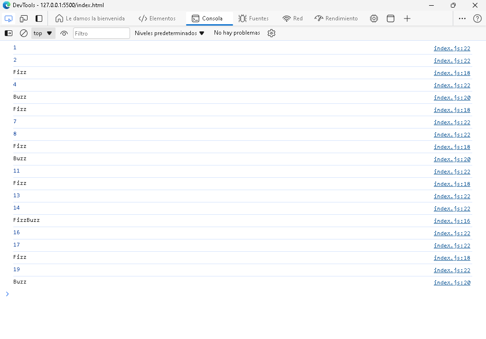

# Fizz Buzz

> A new repository was created for the Odin Porject exercise "FizzBuzz", specifically in the "Problem Solving" section. Fizz buzz is a group word game for children to teach them about division.[1] Players take turns to count incrementally, replacing any number divisible by three with the word "fizz", and any number divisible by five with the word "buzz", and any number divisible by both three and five with the word "fizzbuzz".

Additional description about the project and its features.

## Built With

- Major languages: HTML, CSS & JS.
- Technologies used: Linux, Git Bash.

## Live Demo

[Live Demo Link](https://vxnec0de.github.io/problem_solving/)

## Getting Started

**Clone the repository in Git and run it from a browser..**

## Authors

👤 **Vanessa Carolina Rubio Cheing**

- GitHub: [@VxneC0de](https://github.com/VxneC0de)
- Instagram: [@v_rc20](https://www.instagram.com/v_rc20/)
- LinkedIn: [LinkedIn](https://www.linkedin.com/in/vanessa-rubio-7b7492293/)

## 🤝 Contributing

Contributions, issues, and feature requests are welcome!

Feel free to check the [issues page](https://github.com/VxneC0de/problem_solving/issues).

## Show your support

Give a ⭐️ if you like this project!

## Acknowledgments

- Inspiration: https://www.theodinproject.com/lessons/foundations-problem-solving

## 📝 License

This project is [CC0 1.0 Universal](LICENSE) licensed.